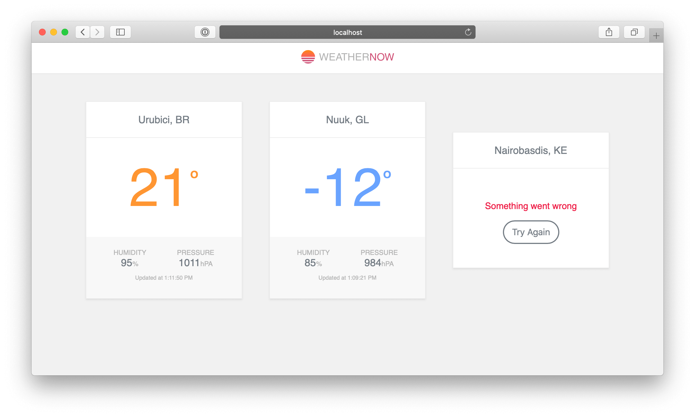

# Weather Now

[](https://github.com/magnobiet)
[](https://angular.io/)
[](https://magno.mit-license.org/2020)

[](http://commitizen.github.io/cz-cli/)
[](https://storybook.js.org/)



## TL;DR

### Development

```bash
# clone this repository and then run
npm install
npm start
```

#### Documentation

##### Storybook

```bash
npm run storybook:start
```

#### Test

```bash
npm run test # just smoke tests for now
```

#### Analyses

##### Bundle size

```bash
npm run bundle-analyzer
```

##### Code Quality

```bash
# start a SonarQube Server (requires Docker)
npm run sonar:start

# when SonarQube Server is up, in another terminal instance/tab run
npm run sonar:scanner
# and then, navigate to http://localhost:9000 and use `admin` as username and password to see the report
```

### Build

```bash
npm run build:prod
npm run start:dist # run a simple HTTP server to preview the application build
```
